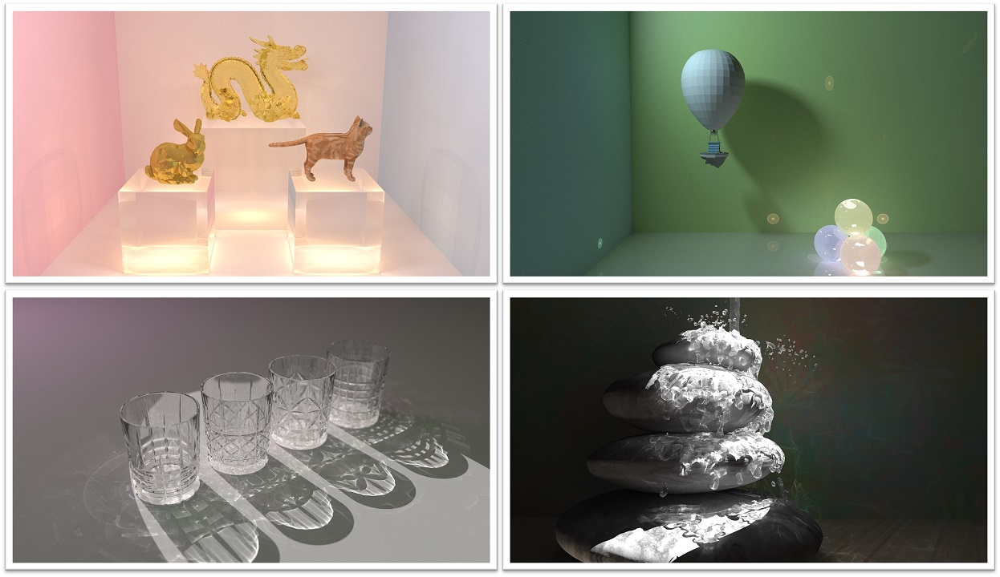
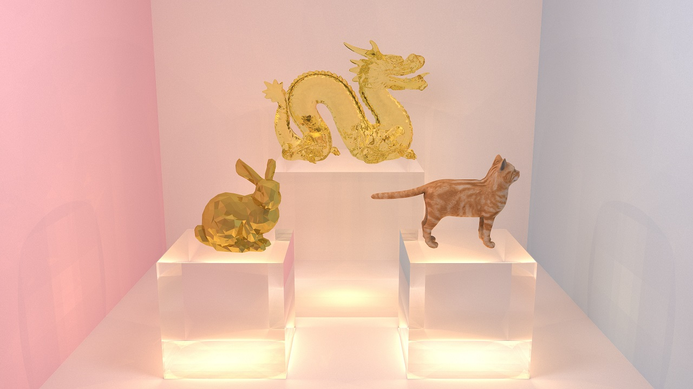
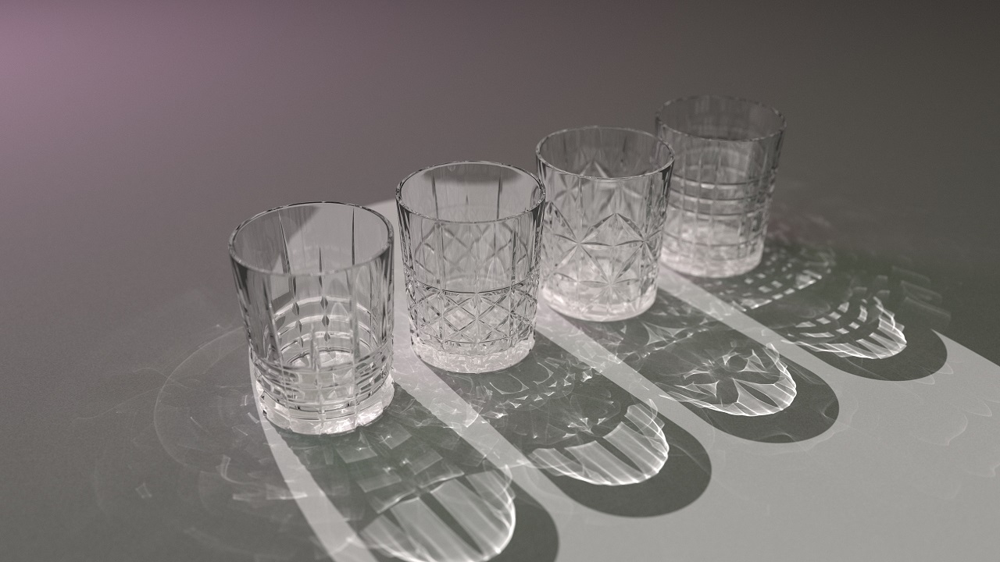

# 代码整体框架

    .
    ├── common
    │   ├── image.cpp
    │   ├── image.hpp
    │   ├── scene.cpp           # 场景定义
    │   └── scene.hpp
    ├── constant.hpp
    ├── core
    │   ├── base_render.cpp
    │   ├── base_render.hpp
    │   ├── camera.hpp          # 相机
    │   ├── hit.hpp             
    │   ├── light.hpp           # 光源
    │   ├── material.hpp        # 材质
    │   ├── object3d.hpp
    │   ├── ray.hpp
    │   ├── sppm_render.cpp     # SPPM
    │   └── sppm_render.hpp
    ├── lib
    │   └── tiny_obj_loader.h
    ├── main.cpp                # 主函数
    ├── objects
    │   ├── group.cpp           # K-D树
    │   ├── group.hpp
    │   ├── mesh.cpp            # 读取.obj格式
    │   ├── mesh.hpp
    │   ├── plane.hpp
    │   ├── sphere.hpp
    │   └── triangle.hpp
    ├── test.cpp
    ├── utils.cpp
    └── utils.hpp

# 光线与物体求交

相关代码位于`objects/`中。

我实现了如下的物体求交：

-   光线与球求交

-   光线与无穷大平面求交

-   光线与三角形求交

因为这部分涵盖在PA1中，所以就不在报告中介绍细节了。

# 反射和折射

相关代码位于`sppm_render.cpp`中。

## 反射

记D为入射光方向，N为表面法向，则反射光方向$R = D - 2(V \cdot N) N$。

## 折射

记D为入射光方向，N为表面法向，r为折射率，则折射光方向$T = r \cdot D - (r (D \cdot N) + \sqrt{1 - r^2 (1 - (D \cdot N)^2)}) N$。

# 渲染算法

## 光线追踪(Path Tracing)

基于"smallpt"实现了光线追踪算法，采集从相机发出的射线，在反射过程中直接统计光照。 它可以渲染出辉映效果，而因为在漫反射面随机选择方向，所以难以渲染出焦散。 并且收敛较慢。 因为效果和smallpt的样例图基本一样，所以就不放图了。

## 光子映射(PPM和SPPM)

相关代码位于`sppm_render.cpp`中。

算法大致流程如下。 首先采集相机发出的射线，把遇到的漫反射碰撞点作为监测点。 然后从光源均匀发射光子，对落入监测点周围有效半径的光子累加光亮度的贡献。 每一轮将有效半径减小按照公式$R'(x) = R(x) \cdot \frac{N(x) + \alpha M(x)}{N(x) + M(x)}$减小一次。 SPPM额外提出，在每一轮中对相机发出的光线增加随机扰动，重新设置监测点的位置，这样可以达到超采样和抗锯齿的作用。 为了加速光子关于检测点的询问，我对监测点构建哈希表。 并在每一轮更新监测点和有效半径后重建哈希表。 使用哈希表能够大幅提高渲染速度。

# 渲染特效

代码中实现了软阴影、超采样抗锯齿、纹理贴图和景深等功能，在报告中重点说明纹理贴图和景深的实现。

## 纹理贴图

相关代码位于`mesh.cpp`和`material.cpp`中。

对于复杂的三角面片网格，读取`.obj`文件中的`vt`值作为顶点的贴图坐标。 在每次求交时计算贴图坐标坐标，在三角形交点处插值得到该点的贴图坐标。 在查询一点的漫反射颜色时把贴图坐标作为参数向材质询问。

## 景深

相关代码位于`sppm_render.cpp`中。

采集相机发出的光线时，对每个像素点发出的射线，保持焦平面上的点不动，对射线起点在一个圆内扰动。 在每轮内分别采样即可。

# 渲染加速

## K-D树

相关代码位于`group.cpp`中。

对于每个元素（球、三角、平面）先计算包围盒范围。 构建K-D树时，先计算当前所有元素的包围盒，然后按照当前维度对元素进行排序，等分成两部分，递归到子节点。 查询一条射线时，先计算射线和左右子节点的包围盒交点距离，若均大于目前的交点距离，则不用继续递归；否则先访问更近的子节点。 在实际场景中，K-D树的运行速度非常快。

## OpenMP

相关代码位于`sppm_render.cpp`中。

使用C++中的多线程库OpenMP只用添加一两行代码就可以实现多线程运行`for`循环。

# 效果展示

{

{width="99%"}

{width="99%"}

{width="99%"}

# 参考文献 

` [1] Kevin Beason. smallpt: Global illumination in 99 lines of c++. http://www.kevinbeason.com/smallpt/. `

\[2\] Toshiya Hachisuka and Henrik Wann Jensen. Stochastic progressive photon mapping. ACM Transactions on Graphics (TOG), 28(5):141, 2009.

\[3\] Toshiya Hachisuka, Shinji Ogaki, and Henrik Wann Jensen. Progressive photon mapping. In ACM Transactions on Graphics (TOG), volume 27, page 130. ACM, 2008.
